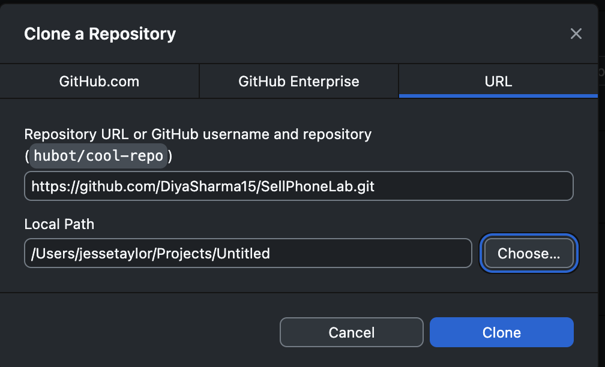

# Introduction

Our team SellPhoneLab is committed to delivering an optimized digital platform that addresses the core needs of mobile device users. Our website offers a visually appealing and intuitive design, while we are also able to integrate features such as a Trade-In-Assessment tool, Automated Online Appointment Booking/Management System, as well as a CSM( Content Management System ) for administrators to add or remove phones easily.
# Getting Started
## Deployed Site

If you would like to see our currently deployed beta website using Vercel, you can navigate to this link and get started!

[SellPhoneLabBetaDeployment](https://sell-phone-lab.vercel.app/)

To report any critical errors, bugs, or suggested updates, please email us [here](mailto:jessetayloor@gmail.com).

## Local Version
### Prerequisites
- Node.JS (LTS Version Recommended)
	- [Node Installation](https://nodejs.org/en)
- NPM (Node Package Manager)
	- Pre-installed with Node.JS
- Modern Web Browser

### Installation

- [ ] Clone Github Repository

**Command Line/Terminal**

	`git clone https://github.com/DiyaSharma15/SellPhoneLab.git`

**OR With Github Desktop**

- [ ] Navigate to Project Directory

**Command Line/Terminal**

	`cd /your/path/SellPhoneLab`

**Visual Studio Code**

`open new terminal window with project open`

- [ ] Install Project Dependencies

	`npm install` or  `npm i` 

- [ ] Start The Development Server

	`npm run dev`

**The application should now be accessible at http://localhost:3000.**

To report any critical errors, bugs, or suggested updates, please email us [here](mailto:jessetayloor@gmail.com).

# Features
SellPhoneLab introduces several key features designed to enhance the customer service experience:

- **Automated Online Appointment Booking/Management System**: Enables user to book appointments and have administrators see and change them if needed.
- **Trade-In Assessment Feature**: Offers customers an instant valuation of their device.
- **AI Supported Live Chat**: **NOT IMPLEMENTED YET**
- **Online Payments**: Streamlines the transaction process with Stripe, offering a secure and straightforward payment gateway.
## Test Payment Methods

Below are the details of the test payment methods that can be used for testing purposes:

### Visa Cards
- **Visa (Credit):**  
  Card Number: `4242 4242 4242 4242`  
  Security Code: Any 3 digits  
  Expiry Date: Any future date  

- **Visa (Debit):**  
  Card Number: `4000 0566 5566 5556`  
  Security Code: Any 3 digits  
  Expiry Date: Any future date  

### Mastercard
- **Mastercard (Credit):**  
  Card Number: `5555 5555 5555 4444`  
  Security Code: Any 3 digits  
  Expiry Date: Any future date  

- **Mastercard (2-series):**  
  Card Number: `2223 0031 2200 3222`  
  Security Code: Any 3 digits  
  Expiry Date: Any future date  

- **Mastercard (Debit):**  
  Card Number: `5200 8282 8282 8210`  
  Security Code: Any 3 digits  
  Expiry Date: Any future date  

- **Mastercard (Prepaid):**  
  Card Number: `5105 1051 0510 5100`  
  Security Code: Any 3 digits  
  Expiry Date: Any future date  

# Admin Features Login

**UserName**
`admin@email.com`
**Password**
`Admin1`

- **Inventory Management**: Change and update the inventory on the website with admin permissions. 
- **View Customer Appointments**: View and confirm/deny appointment requests, reschedule or cancel.
- **Moderate Comments**: Moderate comments/reviews left on the website by customers/users

# Acknowledgements

- Gratitude to our instructor, Achala Vinnakota at SAIT(Southern Alberta Insititute of Technology) for guiding and pushing our team.
- And gratitude for the entire teams hard work and long hours.

# Team

This SellPhoneLab beta deployment is brought to you by a team of dedicated students:

- [Diya Sharma](mailto:harry.diya161@gmail.com)
- [Jesse Taylor](mailto:jessetayloor@gmail.com)
- [Seth Dijkstra](mailto:seth.d87@icloud.com)
- [Sarbjeet Brar](mailto:sarbjeetb2@gmail.com)
- [Yuxiao Shen](mailto:syx2401@gmail.com)
- [Yuvraj Singh](mailto:yuvraj10662@gmail.com)
